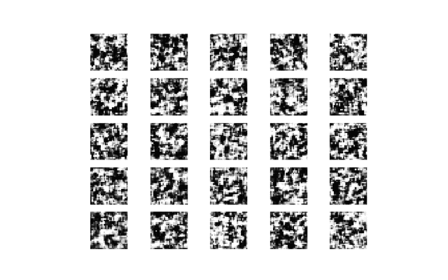

# ssgan
Train mnist dataset with Semi-Supervised GAN.
Model and generated images of progress is saved.

## Requirements
- python3
- pip 18.1
- requirements.txt

## Setup

### Clone the git repositorie
```shell
git clone https://github.com/mina-moto/ssgan
```

### Install required libraries
```shell
pip install -r requirements.txt
```

## Usage

### Train and save progress
```shell
python ssgan.py
```

### Result
train process each 100 iteration:


